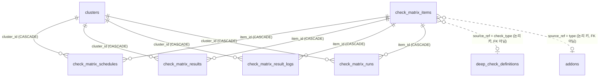

# 점검 매트릭스 운영 매뉴얼 (홈 ▸ 플랫폼 현황)

홈 화면(`/`)의 **플랫폼 현황** 모드에 있는 점검 매트릭스 — 행(점검 항목) × 열(클러스터) —
를 실제로 운영하기 위한 문서다. 화면 안에서도 카드 헤더의 **?** 아이콘으로 같은 내용을
요약해 볼 수 있다.

- 화면 구조/파일 매핑: `docs/SCREENS.md` 의 「홈 (`/`)」 섹션
- Deep Check 체커 자체를 새로 만드는 법: `docs/DEEP_CHECKER_GUIDE.md`
- 코드 위치: `backend/app/routers/check_matrix.py` · `backend/app/services/check_matrix_service.py`
  · `backend/app/services/check_matrix_runbook.py` · `frontend/src/components/platform-status/`

---

## 1. 한 장 요약

| 하고 싶은 것 | 어디서 |
|---|---|
| 이 점검이 내 클러스터에서 **무슨 명령을 도는지** 보기 | 셀 클릭 → **실행 방식** 탭 |
| 기본 등록 점검의 **임계값·파라미터 확인/수정** | 셀 클릭 → **실행 방식** 탭 → **설정 편집** |
| **셀 1개**만 지금 실행 | 셀 클릭 → 우측 상단 **지금 실행** |
| **클러스터(K8s) 전체** 점검 실행 | 클러스터 열 헤더 이름 옆 **▶** |
| **공통 점검 항목**을 전 클러스터에 실행 | 행에 마우스 올리고 **▶** |
| 개별 수행 로그(명령·출력·실행자) 보기 | 카드 헤더 **수행 로그**, 또는 셀 클릭 → **수행 로그** 탭 |
| 자동 실행 주기 바꾸기 | 핵심 항목 = 열 헤더 시계 배지 / 그 외 = 셀 클릭 → **추이 · 이력** 탭 하단 cron |
| 이력 보관 기간 바꾸기 | 카드 헤더 톱니바퀴 |

실행(수동 트리거)과 항목/일정 변경은 **operator 이상** 권한이 필요하다. 조회는 로그인한
사용자면 누구나 가능하다.

---

## 2. 셀이 채워지는 3가지 방식 + 1

행마다 **실행 소스(`source_type`)** 가 정해져 있고, 이것이 그 행의 모든 동작을 결정한다.

셀에는 상태색과 함께 **대표값 숫자**가 표시된다 — 상태색은 판정, 숫자는 여유를 즉시 읽게 한다.

| 점검 | 셀 숫자 | 단위 |
|---|---|---|
| 인증서 만료 | 가장 짧은 인증서 잔여일 | 일 |
| etcd 단편화 / Hubble drop / CoreDNS 에러율 / HTTP·MinIO·pod 프로브류 | 비율 | % |
| ImagePull·CrashLoop / OOM / Stuck Terminating / PVC / 커널 파라미터 변경 | 건수 | 건 |
| 노드 Pressure / 노드 추가 검증 | 이상 노드 수 | 대 |
| cluster-admin sprawl | 대상자 수 | 명 |
| 커스텀 kubectl / PromQL | 측정값 그대로 | (항목 unit) |

대표값 규칙은 `deep_checkers/registry.py` 의 `CELL_VALUE_SPECS` 가 원천이고, 시드 시 항목
unit 도 여기서 채워진다(구버전 DB 는 부팅 시 자동 보강).

| 소스 | 실행 주체 | cron 위치 | 대상 해석 |
|---|---|---|---|
| `core_bundle` | `DailyChecker.run_daily_check()` | 클러스터 열 (`Cluster.check_cron_expr`) | 클러스터 자체 |
| `deep_check` | `DeepCheckService` → 체커 | 셀(항목×클러스터) 또는 정의의 `schedule_cron` | `check_type` → `DeepCheckDefinition` |
| `addon` | `HealthChecker` | 셀(항목×클러스터) | `Addon.type` → 그 클러스터의 `Addon` |
| `manual` | 없음 (사람이 입력) | — | — |

### 2.1 Deep Check — 점검 정의를 실행

PEP 내장 점검기(인증서 만료, etcd 단편화, PVC, CoreDNS, OOM, 노드 Pressure 등)를 돌린다.

1. 항목 추가/수정에서 실행 방식을 **Deep Check** 로 두고 점검 종류(`check_type`)를 고른다.
   여기서 고른 값은 **논리 키일 뿐**이고 임계값·파라미터를 담지 않는다.
2. 실행 시점에 대상을 이렇게 해석한다.
   - ① **이 클러스터 전용 정의**(`DeepCheckDefinition.cluster_id == 이 클러스터`)를 먼저 찾고,
   - ② 없으면 **글로벌 정의**(`cluster_id IS NULL`)로 넘어간다.
   - ③ 둘 다 없으면 이 셀은 실행되지 않고 **건너뜀(skipped)** 으로 로그에 남는다.
3. **임계값(thresholds)·파라미터(params)는 점검 정의에 저장된 값**이 쓰인다. 매트릭스 행에는
   임계값 개념이 없다 — 값을 바꾸려면 운영 점검(Ops Checks) 화면에서 정의를 수정한다.
4. cron 은 두 경로가 있다.
   - **셀 cron** (`CheckMatrixSchedule`) — 이 화면에서 셀별로 설정. 항목별·클러스터별로 다르게 줄 수 있다.
   - **정의 cron** (`DeepCheckDefinition.schedule_cron`) — 정의 자체의 단독 스케줄. 글로벌 정의면
     전 클러스터 대상으로 발화한다. 이 경로로 실행돼도 매트릭스에 같은 `check_type` 행이
     있으면 그 셀의 수행 로그로 함께 남는다.
   - 둘 다 **최소 5분 간격**이며, 그보다 촘촘한 cron 은 저장 단계에서 422 로 거부된다.
5. 커스텀 타입(`custom_http` / `custom_kubectl` / `custom_promql`)은 같은 `check_type` 으로
   여러 정의를 만드는 템플릿형이라 매트릭스 기본 행으로 시드되지 않는다. 매트릭스에 올리면
   `check_type → 정의` 가 1:1 이 아니어서 어느 정의가 돌지 모호해지기 때문이다.

### 2.2 Addon — 등록된 애드온을 헬스 체크

클러스터에 등록해 둔 애드온(etcd, ArgoCD, Nexus, Jenkins, Keycloak, 시스템 파드 등)을 본다.

1. 실행 방식을 **Addon** 으로 두고 애드온 **타입**을 고른다.
2. 실행 시점에 `Addon.type == 고른 타입 AND Addon.cluster_id == 이 클러스터` 로 인스턴스를
   찾는다. 그 클러스터에 등록돼 있지 않으면 **건너뜀**이다.
3. 접속 주소·인증정보는 애드온의 `config` 에서 온다(비어 있으면 클러스터 내부 기본 주소 —
   예: `http://nexus.devops.svc:8081`). 실제로 어떤 URL 을 두드리는지는 **실행 방식** 탭에서
   확인할 수 있다.
4. 결과는 매트릭스 셀뿐 아니라 **애드온 자체의 상태**도 갱신하고, 그 값이 클러스터 전체 상태
   재계산에 반영된다.
5. 애드온 행에는 기본 cron 이 시드되지 않는다 — 자동 실행을 원하면 셀에서 cron 을 직접 넣는다.

### 2.3 수동 입력 — 자동 체커가 없는 대상

NAS 콘솔, 네트워크 스위치, 외주 점검 결과처럼 PEP 가 직접 찌를 수 없는 대상을 같은 매트릭스
위에서 함께 관리한다.

1. 항목 추가에서 실행 방식을 **수동 입력**으로 만든다(점검 종류/애드온 타입은 고르지 않는다).
2. 값을 넣을 셀을 클릭하고 **추이 · 이력** 탭의 **값 입력**에서 상태(정상/경고/위험/대기),
   수치(선택), 메모(선택)를 저장한다.
3. 입력한 값도 자동 점검과 똑같이 이력에 쌓여 추이 차트·변경 이력이 동일하게 동작하고,
   **누가 언제 넣었는지**가 수행 로그에 `수동 입력` 트리거로 남는다.
4. 자동 실행이 없으므로 cron 을 설정할 수 없고 ▶ 실행 버튼도 나오지 않는다. 값을 넣기
   전까지 셀은 `—`(미실행)로 남는다.

### 2.4 핵심 항목(잠금) — `core_bundle`

「K8S API-SERVER 응답시간」 행은 `DailyChecker.run_daily_check()` 를 **원자적으로 한 번**
실행하고 그중 `/healthz` 응답시간만 셀에 투영한 것이다.

- 이 실행이 `Cluster.status`(사이드바 클러스터 색)를 갱신하는 **유일한 경로**라서, 항목별
  cron 이 아니라 **클러스터 열의 cron** 으로 스케줄하고 삭제할 수 없다(비활성화로 숨기기만 가능).
  이름/설명/단위/표시 여부는 다른 행과 똑같이 수정할 수 있다 — 잠기는 건 실행 소스뿐이다.
- 하위 4개 점검(API 서버 / 컴포넌트 / 노드 / 시스템 파드)을 따로 돌릴 수 없는 이유도 같다 —
  종합 판정이 한 번의 실행에서 나와야 한다.
- 판정 기준: `/healthz` 200 이고 3000ms 미만 → 정상, 200 이지만 3000ms 이상 → 경고,
  그 외(비200·연결 실패) → 위험.

---

## 3. 무슨 명령이 도는지 확인하기 (실행 방식 탭)

셀을 클릭하고 **실행 방식** 탭을 열면 그 셀의 **런북**이 나온다.

- **실행 대상** — 이 클러스터에서 해석된 실제 대상(정의 이름 / 애드온 이름). 대상이 없으면
  그 이유와 해결 방법이 함께 뜬다.
- **실행 단계** — 점검이 거치는 단계 흐름.
- **수행되는 명령** — 순서대로 나열되며 종류가 배지로 구분된다.

| 배지 | 뜻 |
|---|---|
| `kubectl` | PEP 백엔드 컨테이너에서 `kubectl --kubeconfig <클러스터 kubeconfig> --server <api_endpoint> …` 로 실행 |
| `K8s API` | kubernetes python SDK 로 API 서버 직접 호출 (kubectl 바이너리 불필요) |
| `HTTP` | 대상 엔드포인트로 직접 HTTP 호출 |
| `SSH` | 대상 장비에 SSH 접속해 읽기 명령 실행 (Isilon NAS 등) |
| `PEP DB` | 대상 클러스터에 접속하지 않고 PEP 내부 데이터만 사용 |
| `변경` | 대상에 변경을 일으킬 수 있는 명령 (예: pod-to-pod 프로브 파드 생성/삭제) |

- **적용되는 설정값** — 실제로 그 명령에 꽂히는 params/thresholds.
- **설정 편집** — 기본 등록된 점검의 임계값·파라미터(애드온이면 config)를 이 자리에서 바로
  수정할 수 있다(operator 이상). 값은 필드 타입(int/float/boolean/list/string)으로 강제되고,
  **비우면 해당 오버라이드가 제거돼 기본값으로 복귀**한다. 셀이 **글로벌 정의**를 쓰고 있으면
  저장이 모든 클러스터에 적용된다는 경고가 뜬다 — 클러스터별로 다르게 두려면 Ops Checks 에서
  클러스터 전용 정의를 만든다. (API: `PUT /cell/{item_id}/{cluster_id}/source-config`)
- **알아둘 점** — 사전 조건(권한/설치 여부)과 판정 규칙.

> 런북은 체커 구현과 1:1 로 맞춰 관리한다(`check_matrix_runbook.py`). 체커의 명령이 바뀌면
> 같은 커밋에서 런북도 바꾼다 — `tests/test_check_matrix_runs.py` 가 모든 `check_type` /
> 애드온 타입에 런북 명령이 있는지 검사한다.

---

## 4. 실행하기 — 3가지 단위

### 4.1 셀 1개 (개별 수행)

셀 클릭 → 우측 상단 **지금 실행**. **동기 실행**이라 응답에 결과가 그대로 오고, 끝나면
그 수행이 **수행 로그** 탭에 자동으로 펼쳐진다. 하나의 셀만 급히 확인할 때 쓴다.

### 4.2 클러스터(K8s) 단위

클러스터 열 헤더 이름 옆 **▶**. 그 클러스터의 **활성화된 모든 자동 점검 항목**(수동 입력 제외)이
한 번에 큐잉된다. 클러스터 교체·점검 직후 전체 상태를 한 번에 새로 뜨고 싶을 때 쓴다.

### 4.3 공통 점검 항목 단위

행에 마우스를 올려 나오는 **▶**. 그 항목이 **등록된 모든 클러스터**에 대해 큐잉된다.
"전 클러스터 인증서 만료를 지금 한 번 훑자" 같은 상황에 쓴다.

### 4.4 일괄 실행의 동작 방식

클러스터/항목 단위는 셀마다 **독립 Celery 작업**으로 큐에 들어간다. 느린 클러스터 하나가
나머지 점검을 막지 않게 하기 위한 것이고, 대신 결과는 즉시가 아니라 순차적으로 채워진다.

- 실행을 누르면 **수행 로그 패널**이 그 일괄 실행(batch)만 필터해 열리고 3초마다 갱신된다.
- 상태 전이: **대기열 → 실행 중 → 완료 / 실패 / 건너뜀**.
- **건너뜀**은 그 클러스터에 실행 대상(정의 또는 애드온)이 없다는 뜻이다. 셀이 계속 `—` 인
  이유는 대부분 여기 있다.
- Celery 워커/브로커가 죽어 있으면 큐잉 자체가 실패하고, 해당 수행이 **실패**로 기록되며
  사유가 남는다(조용히 사라지지 않는다).

---

## 5. 수행 로그

카드 헤더의 **수행 로그** 버튼에서 전체를, 셀 상세의 **수행 로그** 탭에서 그 셀만 본다.
자동(cron)·수동(셀/클러스터/항목)·수동 입력이 모두 한 줄기로 쌓이며 트리거로 필터할 수 있다.

수행 하나를 클릭하면 이런 것이 남아 있다.

- 트리거 종류와 **실행한 사람**, 큐잉/시작/종료 시각과 소요 시간
- **실행 단계** 타임라인 — 어느 단계에서 성공/실패했는지
- **실행된 명령** — 실제로 나간 kubectl 명령, 종료 코드, stdout/stderr 발췌
  (출력은 명령당 2000자, 수행당 30건까지 보관하고 넘치면 앞부분만 남긴다)
- 그 **수행 시점의 실행 계획**(런북 스냅샷)과 체커가 돌려준 결과 상세

> K8s API(SDK)만 쓰는 점검은 "실행된 명령"이 비어 있을 수 있다 — 계측 대상이 kubectl
> 서브프로세스이기 때문이다. 어떤 호출이 나가는지는 실행 계획(런북)에서 확인한다.

### 5.1 추이 이력과 수행 로그의 차이

| | 담는 것 | 테이블 |
|---|---|---|
| 추이 · 이력 | **값이 어떻게 변해왔나** (판정된 결과만) | `check_matrix_result_logs` |
| 수행 로그 | **언제 무엇을 실행했나** (대기열·건너뜀·실패 포함) | `check_matrix_runs` |

판정이 없는 수행(대기열/건너뜀)은 로그에만 남고 추이 차트를 오염시키지 않는다.

### 5.2 보관 기간

카드 헤더 톱니바퀴의 **이력 보관 일수** 하나가 값 이력과 수행 로그 양쪽에 적용된다.
매일 03:00 KST `check-matrix-log-purge` Beat 가 기간 초과분을 청크 단위로 지운다.
수행 로그는 명령 출력을 담아 값 이력보다 행이 크므로 DB 용량을 고려해 설정한다.

---

## 6. 환경 차이 대응 (UI-First 원칙)

설치 현장마다 구성이 다르다 — etcd 가 파드인지 systemd 데몬인지, env 파일 경로,
네임스페이스, 라벨 셀렉터, 엔드포인트 주소. **PEP 는 이런 차이를 파이썬 파일 수정 없이
화면에서 바꿀 수 있어야 한다**(프로젝트 원칙 — `CLAUDE.md` §UI-First 원칙).

### 6.1 어디서 바꾸나

| 바꿀 것 | 화면 |
|---|---|
| 점검의 임계값·파라미터 | 매트릭스 셀 ▸ **실행 방식** 탭 ▸ **설정 편집** |
| 애드온 접속 주소·인증 (config) | 같은 자리 (애드온 행) |
| 점검 정의 자체(이름/활성/cron) | 운영 점검(Ops Checks) 화면 |
| 실행 주기 | 셀 상세 ▸ 추이·이력 탭 하단 cron / 클러스터 열 시계 배지 |

값을 비우면 그 항목의 오버라이드가 지워져 **기본값으로 복귀**한다.

### 6.2 etcd 가 파드가 아니라 데몬(systemd)인 환경

kubeadm 이 아닌 구성에서는 etcd 가 master 노드의 **systemd 유닛**으로 뜨고 환경변수는
`/etc/etcd.env` 에 있다 — `kube-system` 에 etcd 파드가 없으므로 pod exec 경로가 통하지 않는다.
`etcd_defrag` 점검은 이 두 환경을 **파라미터로 선택**한다.

| `source` | 동작 |
|---|---|
| `auto` (기본) | etcd 파드를 먼저 찾고, 없으면 자동으로 스냅샷 경로로 폴백 |
| `pod` | 파드형 etcd 전용 (`kubectl exec … etcdctl endpoint status`) |
| `snapshot` | 데몬 etcd 전용 — 수집된 `etcdctl_config` 스냅샷만 사용 |

**스냅샷 경로 사용 절차** (데몬 etcd):

1. **버전 / 설정 관리(`/versions`)** 화면에서 etcd 설정 수집을 실행한다. master 노드에 SSH 로
   접속해 `/etc/etcd.env` 를 `source` 한 뒤 `etcdctl endpoint status -w json` 을 수집하고,
   `cluster_config_snapshots` 에 `etcdctl_config:{host}` 로 저장한다.
   - env 파일 경로가 다르면 그 화면의 `env_files` 목록에서 바꾼다.
   - **자격증명은 저장되지 않는다** — 요청 시에만 쓰이고 DB 에 남지 않는다.
2. 매트릭스의 etcd 행은 이 스냅샷을 읽어 단편화율을 계산한다. 수집이 `snapshot_max_age_hours`
   (기본 24h)보다 오래되면 판정하지 않고 **대기(pending)** 로 남긴다 — 낡은 값으로 "정상"이라고
   말하지 않기 위해서다.
3. 알람(`alarm list`)은 스냅샷에 없다 — 파드 경로이거나 **etcdctl 콘솔(`/etcdctl`)** 에서
   확인한다. 그 콘솔도 `/etc/etcd.env` 를 기본 env 파일로 쓰고 경로를 바꿀 수 있다.

> 체커가 직접 SSH 하지 않는 이유: params 는 JSONB 라 런북·실행 로그에 그대로 노출된다.
> 자격증명을 거기 담지 않으려고 수집(자격증명 미저장 UI 흐름)과 판정(스냅샷 읽기)을 분리했다.

### 6.3 새 환경 차이가 생기면

점검이 우리 환경과 안 맞는데 화면에서 바꿀 수 없다면 그건 **구현 결함**이다. 해당 값을
`param_fields` 로 노출하도록 체커를 고치고(`.claude/skills/add-deep-checker/SKILL.md`),
같은 커밋에서 런북 명령 목록도 갱신한다. 코드 수정 없이 운영자가 대응할 수 있는 상태가 기준이다.

---

## 7. 트러블슈팅

| 증상 | 확인할 것 |
|---|---|
| 행/셀에 **실행 ▶ 버튼이 없다** | 행 이름 옆 배지를 본다 — `수동` 배지면 수동 입력 항목이라 실행 버튼이 없는 게 정상이다(값 입력만 가능). 자동 점검으로 바꾸려면 행의 연필(수정)에서 실행 방식을 Deep Check/Addon 으로 변경한다. |
| 셀이 계속 `—` 다 | 수행 로그에 **건너뜀**이 있는지 → deep_check 은 점검 정의, addon 은 애드온 등록 여부. 수동 입력 항목이면 값을 넣기 전까지 정상이다. |
| ▶ 를 눌렀는데 아무것도 안 바뀐다 | 일괄 실행은 큐잉이다. 열린 수행 로그 패널에서 대기열/실행 중 상태를 확인. 전부 **실패** + "Celery 워커/브로커" 문구면 워커가 죽은 것. |
| cron 을 저장하면 422 가 뜬다 | 최소 5분 간격 제약. `*/1 * * * *` 같은 표현은 거부된다. |
| 셀은 정상인데 클러스터 색이 위험이다 | 클러스터 상태는 `core_bundle`(DailyChecker)과 애드온 상태에서 나온다. 개별 deep_check 셀 색과 직접 연결되지 않는다. |
| etcd 점검이 "etcd pod 를 찾지 못했습니다" | 데몬(systemd) etcd 환경이다. 설정 편집에서 `source` 를 `auto` 또는 `snapshot` 으로 두고, `/versions` 화면에서 etcd 설정 수집을 먼저 실행한다 (§6.2). |
| deep check 실행이 500 (`daily_check_log_id` NOT NULL) | 구버전 DB 의 레거시 제약. 백엔드를 재시작하면 부팅 마이그레이션이 자동으로 푼다(`ALTER COLUMN … DROP NOT NULL`). |
| 상태가 **대기(pending)** 로 남는다 | 연결 거부/타임아웃은 위험이 아니라 대기로 판정한다(클러스터가 죽은 것과 PEP 가 못 닿는 것을 구분하기 위함). 수행 로그의 stderr 를 본다. |
| 자동 실행이 아예 안 돈다 | 클러스터 열 cron 이 비어 있거나(핵심 항목), 셀 cron 이 비활성이거나, `check-matrix-dispatch` Beat 가 안 도는 경우. |

---

## 8. DB 구조 (Schema Audit)

점검 매트릭스가 소유한 테이블 5개와 실행 시 참조하는 인접 테이블의 관계다. 모델 원천은
`backend/app/models/check_matrix.py`, 인접 모델은 `deep_check.py` · `addon.py` · `cluster.py`.

### 8.1 테이블별 역할·핵심 컬럼·인덱스

| 테이블 | 역할 | 핵심 컬럼 | 인덱스/제약 |
|---|---|---|---|
| `check_matrix_items` | 행 카탈로그 | `source_type`(enum: core_bundle/deep_check/addon/manual) · `source_ref`(논리 키) · `unit`(셀 값 단위) · `is_system` · `enabled` · `sort_order` | PK 만 (소규모 테이블) |
| `check_matrix_schedules` | 셀 cron | `cron_expr`(NULL=미스케줄) · `enabled` · `last_run_at`(디스패처 anchor) | `uq(item_id, cluster_id)` |
| `check_matrix_results` | 셀 최신 스냅샷 | `status` · `value` · `message` · `details`(JSONB) · `checked_at` — **upsert**(`ON CONFLICT`) | `uq(item_id, cluster_id)` |
| `check_matrix_result_logs` | 값 이력 (append-only) | Result 와 동일 컬럼 — 추이 차트/변경 이력의 원천 | `(item_id, cluster_id, checked_at)` + `checked_at` 단독(퍼지 스캔용) |
| `check_matrix_runs` | **수행 로그** | `batch_id`(일괄 실행 묶음) · `trigger`(enum: cron/manual_cell/manual_cluster/manual_item/manual_entry) · `triggered_by`(표시명 — 의도적으로 FK 없음, 사용자 삭제 후에도 로그 보존) · `run_state`(enum: queued/running/success/failed/skipped) · `status`/`value`/`message`/`error` · `details`(JSONB: `_steps`/`_commands`/`_runbook`) · `queued_at`/`started_at`/`finished_at`/`duration_ms` | `(item_id, cluster_id, queued_at)` + `queued_at` + `batch_id` |

인접 참조 (실행 시점 해석 — FK 없음이 설계):

| 컬럼 | 참조 | 의미 |
|---|---|---|
| `items.source_ref` (deep_check) | `deep_check_definitions.check_type` | 클러스터 전용 정의 우선 → 글로벌 폴백. 정의가 삭제돼도 행은 남고 셀은 "건너뜀" |
| `items.source_ref` (addon) | `addons.type` (+ cluster_id) | 그 클러스터에 애드온이 없으면 "건너뜀" |
| `clusters.check_cron_expr` / `check_last_run_at` | — | core_bundle 행의 cron / 디스패처 anchor |
| `app_settings` key `check_matrix.settings` | — | 이력 보관 일수 (`retention_days`) |

### 8.2 스키마 운영 특성 (audit 결과)

- **삭제 전파**: 항목/클러스터를 지우면 스케줄·결과·값 이력·수행 로그가 전부 CASCADE 로
  정리된다 — 고아 행 없음.
- **enum 3종**(`checkmatrixsourcetype`/`checkmatrixtrigger`/`checkmatrixrunstate`)은
  `create_all` 이 생성한다. **값을 추가할 때는** 모델 enum 수정 + `main.py` 에
  `_safe_exec("ALTER TYPE ... ADD VALUE IF NOT EXISTS ...")` 보강이 필요하다(구버전 DB).
- **테이블/인덱스 생성 경로**: 신규 테이블은 부팅 시 `create_all`, 인덱스는 모델
  `__table_args__` 가 원천이고 `main.py` 의 `_safe_create_index` 는 (테이블만 있고 인덱스가
  없는 구버전 DB 를 위한) 보강 경로다 — 같은 이름이면 skip 되므로 중복 생성되지 않는다.
- **runs.details 는 행이 크다**: 명령 출력 발췌(명령당 2000자·수행당 30건)와 런북 스냅샷을
  담는다. 값 이력과 같은 보관 일수로 매일 03:00 퍼지되며, 보관 일수를 늘릴 때는 이 테이블
  용량을 함께 고려한다.
- **이중 기록(의도)**: deep_check 셀 실행은 `check_matrix_results`(+runs) 와
  `deep_check_results` 양쪽에 남는다 — 전자는 매트릭스 화면, 후자는 심층 점검 이력 화면의
  원천이고 보관 주기 설정을 공유한다.
- **백업**: 값 이력·수행 로그는 `backup_service.LOG_TABLES` 에 등록돼 `include_logs=False`
  export 에서 제외된다.

---

## 9. API 요약

모두 `/api/v1/check-matrix` 하위. 실행/변경은 operator 이상.

| 메서드 | 경로 | 용도 |
|---|---|---|
| GET | `/cell/{item_id}/{cluster_id}/runbook` | 실행 계획 조회 (실행하지 않음) |
| POST | `/cell/{item_id}/{cluster_id}/run` | 셀 1개 동기 실행 → 수행 결과 |
| POST | `/clusters/{cluster_id}/run` | 클러스터 단위 일괄 큐잉 → `batch_id` |
| POST | `/items/{item_id}/run` | 항목 단위 일괄 큐잉 → `batch_id` |
| GET | `/runs?item_id=&cluster_id=&batch_id=&trigger=&limit=&offset=` | 수행 로그 목록 |
| GET | `/runs/{run_id}` | 수행 1건 상세(단계·명령·런북·결과) |
